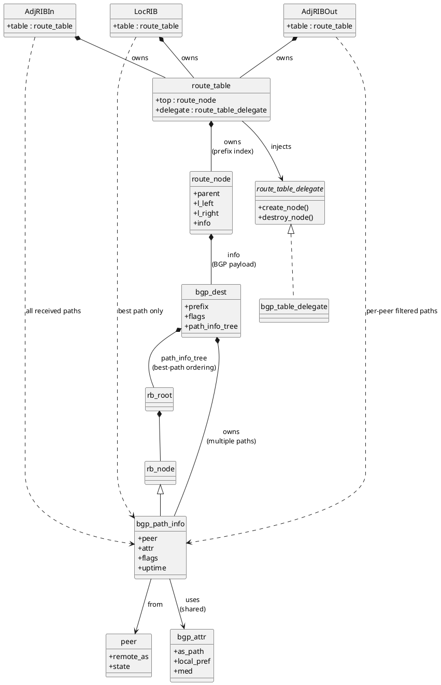

# 🧩 FRR BGP RIB 全展开类图

## Adj-RIB-In / Loc-RIB / Adj-RIB-Out

（PlantUML，可直接使用）




---

# 🧠 如何“正确理解”三套 RIB（这是核心）

下面这部分**比图更重要**。

---

## 1️⃣ 三套 RIB **不是三种结构**

**这是 FRR 设计的精髓：**

> **Adj-RIB-In / Loc-RIB / Adj-RIB-Out
> 在“数据结构上是同一个模型”**

它们的差异是：

| RIB         | 差异点      |
| ----------- | -------- |
| Adj-RIB-In  | **接收语义** |
| Loc-RIB     | **选择语义** |
| Adj-RIB-Out | **发送语义** |

---

## 2️⃣ Adj-RIB-In：**“所有可能的路径”**

```text
Adj-RIB-In
 └─ prefix
     └─ bgp_dest
         └─ RB-tree
             ├─ path from peer A
             ├─ path from peer B
             └─ path from peer C
```

**特点：**

* 每个 peer 一条（或多条）path
* 不做 best-path 决策
* 是 **策略 / RPKI / dampening 的输入池**

📌 FRR 中很多“revalidate / reprocess”都是从这里扫的。

---

## 3️⃣ Loc-RIB：**“控制平面认定的真理”**

```text
Loc-RIB
 └─ prefix
     └─ bgp_dest
         └─ RB-tree
             └─ ★ best path
```

⚠️ **关键点（很多人会误解）：**

* Loc-RIB **仍然是 RB-tree**
* 但 **逻辑上只有 best path 有效**
* 其它 path 可能存在，但被 flag 掉

👉 这是为了：

* 快速 re-evaluate
* 避免频繁 malloc/free

---

## 4️⃣ Adj-RIB-Out：**“视 peer 而定的世界”**

```text
Adj-RIB-Out (per peer)
 └─ prefix
     └─ bgp_dest
         └─ RB-tree
             └─ path after outbound policy
```

**注意两个事实：**

1. Adj-RIB-Out **通常是 per-peer 的**
2. 不是简单复制 Loc-RIB

它会经历：

* outbound policy
* next-hop-self
* AS-PATH prepend
* community rewrite

---

## 5️⃣ 为什么三套 RIB 不“共享 path_info”？

这是 **FRR 非常谨慎的地方**：

* Adj-RIB-In：原始输入
* Loc-RIB：选择结果
* Adj-RIB-Out：发送视图

👉 **状态不能污染**
👉 **生命周期不同**
👉 **flags 语义不同**

---

## 6️⃣ 再把整条路径串成一句话（记住这句）

> **BGP UPDATE → Adj-RIB-In
> → best-path selection → Loc-RIB
> → outbound policy → Adj-RIB-Out
> → TCP 179**

---

## 🧩 这张图解决了哪些“长期困惑”

✔ 为什么 FRR 的 bgp_path_info 这么多

✔ 为什么 re-evaluate 不需要重建所有节点

✔ 为什么 RPKI / policy 触发会扫一整棵树

✔ 为什么 Adj-RIB-Out 很难“直接理解”

---

