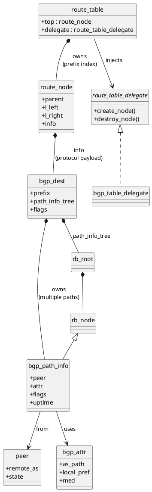

# 🧩 FRR BGP RIB 内部结构

## route_table → bgp_dest → bgp_path_info → RB-tree

> **定位**：
>
> * `bgp_table.c / bgp_route.c / table.c`
> * 对应 `Adj-RIB-In / Loc-RIB / Adj-RIB-Out`

---

## ✅ 标准 PlantUML 类图（可直接用）



---

## 🧠 如何“正确理解”这张图（重点逐层拆）

下面这部分非常关键，我按 **FRR 作者视角**给你解释。

---

## 1️⃣ route_table / route_node：**协议无关的“前缀索引层”**

```text
route_table
  └─ route_node (radix / patricia)
```

**只做一件事**：

> 👉 **prefix → node**

它 **完全不知道**：

* BGP / OSPF / Zebra
* path / metric / policy

这就是 FRR 能复用 table 的根本。

---

## 2️⃣ bgp_dest：**“BGP 语义容器”**

```plantuml
route_node *-- bgp_dest
```

`bgp_dest` 是 **BGP 才关心的东西**：

* prefix（拷贝 or reference）
* flags（valid / dampened / best）
* **path_info_tree（核心）**

📌 **关键点**：

> **一个 prefix = 一个 bgp_dest**

---

## 3️⃣ bgp_path_info：**“路径，不是路由”**

```plantuml
bgp_dest *-- bgp_path_info
```

你一定要记住这句话：

> **BGP 的核心不是 route，而是 path**

一个 prefix 下可以有：

* 来自多个 peer
* 不同 AS_PATH
* 不同 MED / LOCAL_PREF

👉 每一条 = 一个 `bgp_path_info`

---

## 4️⃣ 为什么是 red-black tree？（关键设计点）

```plantuml
rb_node <|-- bgp_path_info
bgp_dest *-- rb_root
```

### ❓ 为什么不用 list / array？

因为 FRR 需要：

| 需求           | RB-tree |
| ------------ | ------- |
| 快速插入/删除      | ✅       |
| 按策略排序        | ✅       |
| 稳定遍历         | ✅       |
| best-path 重算 | ✅       |

👉 **RB-tree = path selection 的物理基础**

---

## 5️⃣ rb-tree 排序“按什么”？

不是 prefix，而是 **策略 key**：

```text
(local_pref, as_path_len, origin, med, peer_id, ...)
```

这正是：

```c
bgp_path_info_cmp()
```

存在的原因。

---

## 6️⃣ peer / attr 为什么不“内嵌”？

```plantuml
bgp_path_info --> peer
bgp_path_info --> bgp_attr
```

这是 **FRR 内存与性能设计的精华**：

* `peer`：全局对象
* `bgp_attr`：引用计数 / hash 共享
* `bgp_path_info`：轻量、可频繁创建销毁

👉 **避免 N×M 级别内存爆炸**

---

## 7️⃣ delegate 在 BGP 中的真实意义

```plantuml
route_table --> route_table_delegate
route_table_delegate <|.. bgp_table_delegate
```

delegate 控制的是：

* `route_node.info` 的创建/释放
* BGP table 的“策略行为”

而不是路径选择本身（那在 bgp_path_info 层）。

---

## 🧩 把整条链串成一句话（非常重要）

> **FRR BGP RIB =**
>
> **Radix 树（prefix）**
> → **bgp_dest（语义容器）**
> → **RB-tree（路径集合）**
> → **bgp_path_info（路径实体）**

---

## 🧠 为什么 FRR 能这么“优雅”

因为它**严格分离了四件事**：

| 层级            | 关注点     |
| ------------- | ------- |
| route_table   | 索引      |
| bgp_dest      | 协议语义    |
| rb-tree       | 排序 / 算法 |
| bgp_path_info | 路径状态    |

---
