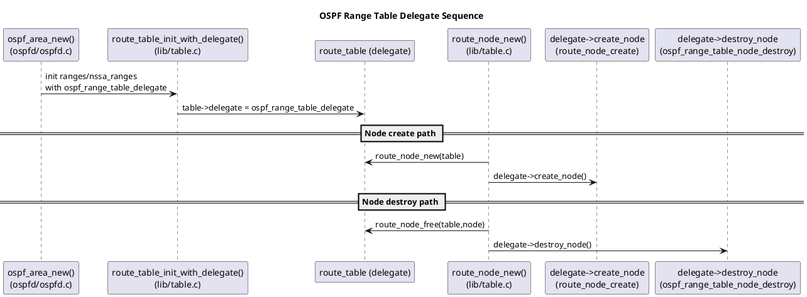
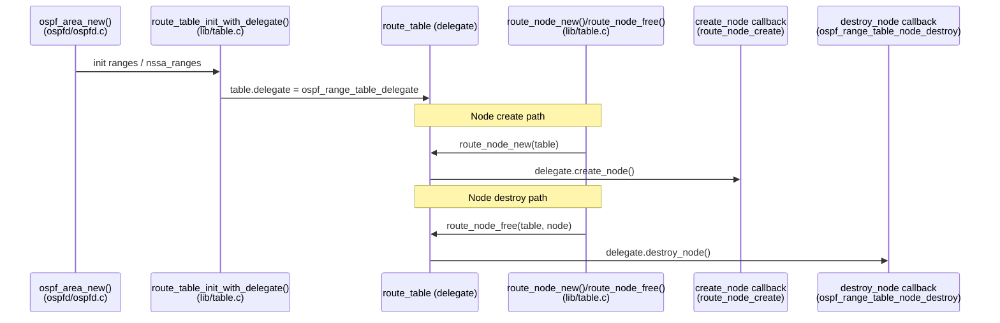
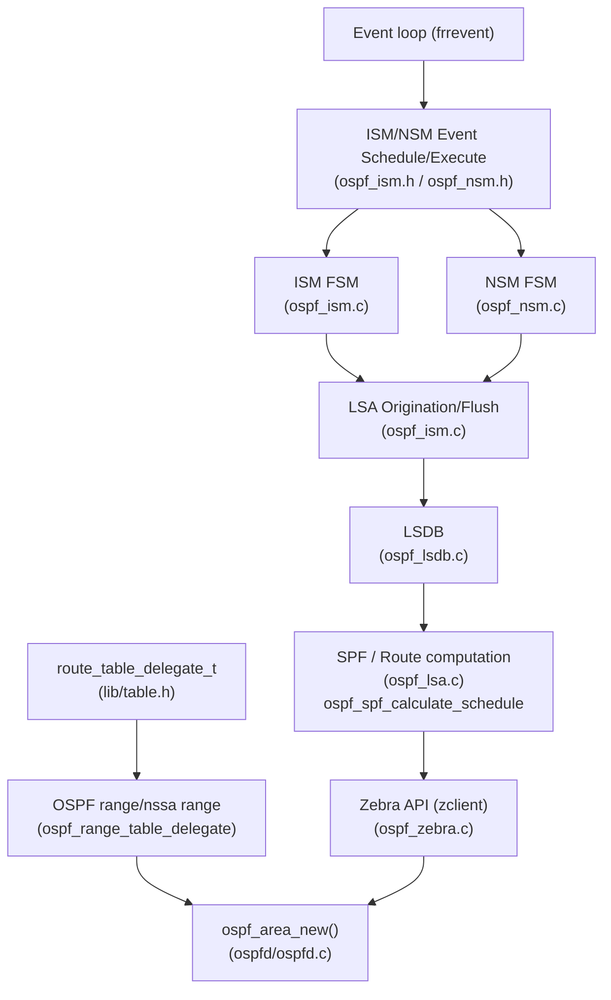
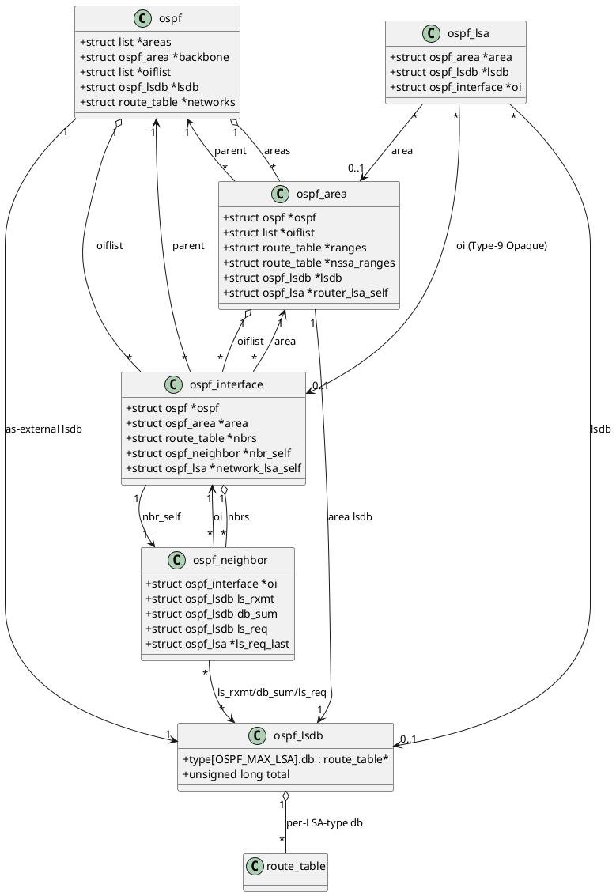
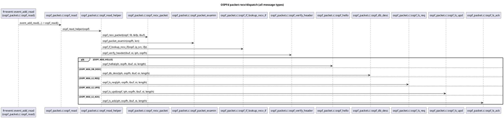
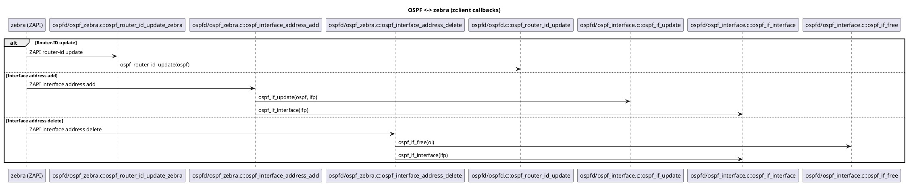
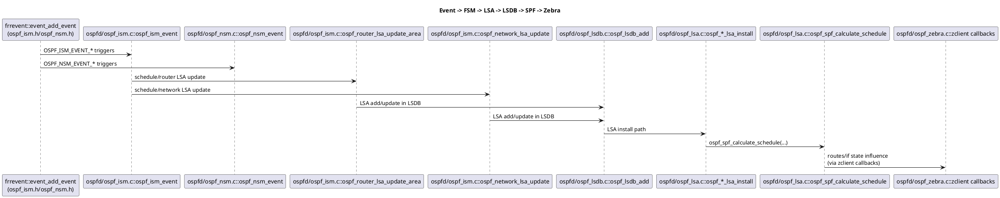

# FRR OSPF Delegate / FSM / LSA / Zebra 分析归档

> 归档目的：汇总 OSPF 使用 delegate 的实现方式、关键数据结构关系、消息处理链路、zclient 交互流程，以及 Event/FSM/LSA/Zebra 端到端链路。
> 该文档用于后续扩展其他协议或子系统的分析文档。

---

## 1. OSPF 如何使用 delegate（route_table_delegate_t）

### 1.1 delegate 机制概览（通用）
- `route_table_delegate_t` 是路由表“委托接口”，提供 create/destroy 的函数指针。
- `route_table_init_with_delegate()` 把 delegate 挂到 table 上；后续 `route_node_new()` / `route_node_free()` 通过 delegate 的回调创建/销毁节点。

**关联源码：**
- `lib/table.h`：`route_table_delegate_t` 定义、`route_table` 持有 `delegate`。
- `lib/table.c`：`route_table_init_with_delegate()`、`route_node_new()`、`route_node_free()`。

### 1.2 OSPF 在哪里使用 delegate
- OSPF 仅在 **Area range / NSSA range** 表中使用自定义 delegate。
- `ospf_range_table_delegate` 使用默认 `route_node_create()` 创建，但销毁时调用 `ospf_range_table_node_destroy()`，释放 `node->info` 与 node 本体。

**关联源码：**
- `ospfd/ospfd.c`：`ospf_range_table_delegate`、`ospf_range_table_node_destroy()`、`ospf_area_new()` 中的 `route_table_init_with_delegate()`。

### 1.3 LSDB 未使用自定义 delegate
- `ospf_lsdb_init()` 通过 `route_table_init()` 初始化 LSA DB，使用默认 delegate。

**关联源码：**
- `ospfd/ospf_lsdb.c`。

---

## 2. OSPF delegate 关键时序图

### 2.1 PlantUML（delegate 创建/销毁）

### 2.2 Mermaid（delegate 创建/销毁）

---

## 3. OSPF delegate 全景图（event / FSM / LSA / zebra）

> ISM: Interface State Machine
>
> NSM: Neighbor State Machine

---

## 4. OSPF 关键数据结构与类图

### 4.1 关键结构（摘要）
- **ospf**：全局 OSPF 实例，持有 `areas`、`oiflist`、AS 级 LSDB 等。
- **ospf_area**：area 上下文，持有 area 级 LSDB、ranges/nssa_ranges。
- **ospf_interface**：接口上下文，持有邻居表、self network LSA。
- **ospf_neighbor**：邻居状态，持有重传/摘要/请求三类 LSDB。
- **ospf_lsa**：LSA 实例，关联 area / lsdb / interface。
- **ospf_lsdb**：每类 LSA 一张 route_table。

### 4.2 PlantUML 类图

---

## 5. OSPFd 接收并处理每种消息的完整时序图

涉及消息：Hello / DB-Desc / LS-Req / LS-Upd / LS-Ack。入口点在 `ospf_read()` / `ospf_read_helper()`。

---

## 6. OSPF 通过 zclient 处理 router-id 与接口地址变更的全流程时序图

---

## 7. Event / FSM / LSA / Zebra 链路时序图

---

## 8. Zebra 名称与作用（基于仓库文档）

### 8.1 Zebra 的作用
- **zebra 是 IP 路由管理进程**，负责内核路由表更新、接口信息查询与路由重分发。
- OSPF（`ospfd`）必须通过 zebra 获取接口信息与路由器 ID；因此 zebra 必须先于 ospfd 启动。

**关联文档：**
- `doc/user/zebra.rst`
- `doc/user/ospfd.rst`

### 8.2 名称由来说明
- FRR 仓库文档中**未包含“zebra 名称由来”说明**；该问题需要外部资料才能回答。

---

## 9. 参考文件索引（便于进一步扩展）
- `lib/table.h`, `lib/table.c`
- `ospfd/ospfd.c`, `ospfd/ospfd.h`
- `ospfd/ospf_packet.c`
- `ospfd/ospf_ism.c`, `ospfd/ospf_nsm.c`
- `ospfd/ospf_lsa.c`, `ospfd/ospf_lsdb.c`
- `ospfd/ospf_zebra.c`
- `doc/user/zebra.rst`, `doc/user/ospfd.rst`

---

## 10. 后续可扩展方向
- 按协议分区：`docs/analysis/ospf/`、`docs/analysis/bgp/`、`docs/analysis/isis/`
- 按主题分区：`docs/analysis/fsm/`、`docs/analysis/lsdb/`、`docs/analysis/zebra/`
