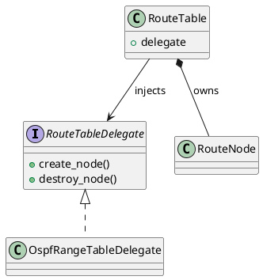

## 一、类本身（Class）


### 1️⃣ 基本类

```plantuml
class RouteTable
```

### 2️⃣ 带属性 / 方法

```plantuml
class RouteTable {
    +routes : map
    +delegate : route_table_delegate
    --
    +lookup(prefix)
    +insert(node)
}
```

**符号说明**

| 符号  | 含义        |
| --- | --------- |
| `+` | public    |
| `-` | private   |
| `#` | protected |
| `~` | package   |

---

### 3️⃣ 抽象类

```plantuml
abstract class RouteNode
```

---

### 4️⃣ 接口（interface）

```plantuml
interface RouteTableDelegate {
    +create_node()
    +destroy_node()
}
```

---

## 二、类之间的关系（重点）


---

## 1️⃣ 继承（Inheritance / Generalization）

```plantuml
RouteNode <|-- OspfRangeNode
```

**符号**

```
<|--
```

**语义**

> **is-a**
>
> OspfRangeNode 是一种 RouteNode

📌 *用于结构继承*

---

## 2️⃣ 接口实现（Realization）

```plantuml
RouteTableDelegate <|.. OspfRangeTableDelegate
```

**符号**

```
<|..
```

**语义**

> 实现接口（C 中常对应 function table / ops）

📌 **FRR delegate 模式核心**

---

## 3️⃣ 关联（Association）

```plantuml
RouteTable --> RouteNode
```

**符号**

```
-->
```

**语义**

> “知道对方 / 使用对方”

📌 最宽松、最常用

---

## 4️⃣ 依赖（Dependency）

```plantuml
OspfArea ..> RouteTable
```

**符号**

```
..>
```

**语义**

> 临时使用（函数参数 / 局部变量）

📌 不拥有生命周期

---

## 5️⃣ 聚合（Aggregation）◇

```plantuml
RouteTable o-- RouteNode
```

**符号**

```
o--
```

**语义**

> 弱拥有关系
> RouteNode 可脱离 RouteTable 存在

📌 很少在底层代码里严格区分

---

## 6️⃣ 组合（Composition）◆（**非常重要**）

```plantuml
RouteTable *-- RouteNode
```

**符号**

```
*--
```

**语义**

> **强生命周期绑定**
> RouteTable 销毁 ⇒ RouteNode 必销毁

📌 **FRR 的 route_table ↔ route_node 就是典型组合关系**

---

## 三、方向箭头速记表

| 符号    | 名称   | 常用语义          |            |
| ----- | ---- | ------------- | ---------- |
| `--`  | 无向关联 | 很少用           |            |
| `-->` | 单向关联 | owns / uses   |            |
| `<--` | 反向关联 | 被使用           |            |
| `*--` | 组合   | 生命周期绑定        |            |
| `o--` | 聚合   | 弱拥有           |            |
| `<    | --`  | 继承            | is-a       |
| `<    | ..`  | 接口实现          | implements |
| `..>` | 依赖   | temporary use |            |

---

## 四、修饰信息（Multiplicity / Label）

### 1️⃣ 多重性（数量关系）

```plantuml
RouteTable "1" *-- "N" RouteNode
```

```plantuml
OspfArea "1" --> "*" RouteTable
```

---

### 2️⃣ 关系标签（推荐用）

```plantuml
RouteTable *-- RouteNode : owns
RouteTable --> RouteTableDelegate : uses
```

📌 **比 UML 规范更重要的是“可读性”**

---

## 五、FRR / delegate 场景的标准写法（示例）



👉 这张图一眼就能看出：

* **容器 vs 策略**
* **生命周期归属**
* **delegate 注入关系**

---

## 六、建议（非常重要）

### ✔ 不要过度追求 UML“学术正确”

> **PlantUML 的类图 = 架构沟通工具，不是论文**

### ✔ 在 C / 内核 / FRR 项目中

| 场景               | 推荐关系       |     |
| ---------------- | ---------- | --- |
| struct 拥有 struct | `*--`      |     |
| ops / delegate   | `-->` + `< | ..` |
| 函数参数             | `..>`      |     |
| 父子结构             | `<         | --` |

---

## 一句话总结

> **看生命周期 → 用 `*--`
> 看接口 / ops → 用 `<|..`
> 看调用 / 使用 → 用 `-->` 或 `..>`**

---
